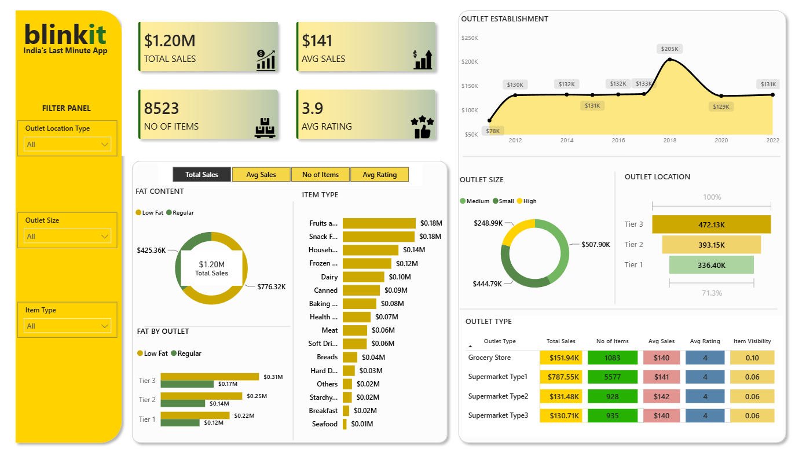

📊 Blinkit Sales Analysis Dashboard | Power BI

📌 Project Overview

This project is an interactive Power BI dashboard created to analyze Blinkit's sales performance, outlet characteristics, customer ratings, and inventory distribution.

The dashboard provides a comprehensive view of key business metrics and helps identify sales trends and opportunities for business optimization.

---

🎯 Business Objective

To conduct a comprehensive analysis of Blinkit's sales performance, customer satisfaction, and inventory distribution using key performance indicators (KPIs) and interactive visualizations in Power BI.

---

📊 KPI Requirements

The dashboard focuses on the following key performance indicators:

- 💰 Total Sales
- 📈 Average Sales
- 📦 Number of Items
- ⭐ Average Rating

---

🔍 Analysis Performed

 1. Total Sales by Fat Content

Analyzed total sales based on different fat-content categories.

**Objective:**  
Understand the impact of fat content on sales performance.

---

 2. Total Sales by Item Type

Analyzed sales performance across different item categories.

**Objective:**  
Identify the item types contributing the most to total sales.
📊 Blinkit Sales Analysis Dashboard | Power BI


An interactive Power BI dashboard that analyzes **Blinkit's** sales performance, outlet characteristics, customer ratings, and inventory distribution — built to surface actionable insights for business optimization.



---

📌 Table of Contents
- [Business Objective](#-business-objective)
- [KPIs Tracked](#-kpis-tracked)
- [Analysis Performed](#-analysis-performed)
- [Key Insights](#-key-insights)
- [Dashboard Features](#-dashboard-features)
- [Interactive Filters](#️-interactive-filters)
- [Sample DAX Measures](#-sample-dax-measures)
- [Tools & Technologies](#️-tools--technologies)
- [Project Structure](#-project-structure)
- [How to Use](#-how-to-use)

---

🎯 Business Objective

To conduct a comprehensive analysis of Blinkit's sales performance, customer satisfaction, and inventory distribution using key performance indicators (KPIs) and interactive visualizations in Power BI — identifying key insights and opportunities for optimization.

---

📊 KPIs Tracked

| KPI | Description | Value |
|---|---|---|
| 💰 Total Sales | Overall revenue generated from all items sold | **$1.20M** |
| 📈 Average Sales | Average revenue per sale | **$141** |
| 📦 Number of Items | Total count of items sold | **8,523** |
| ⭐ Average Rating | Average customer rating across items | **3.9 / 5** |

---

🔍 Analysis Performed

| # | Analysis | Objective |
|---|---|---|
| 1 | **Total Sales by Fat Content** | Understand the impact of fat content on sales performance |
| 2 | **Total Sales by Item Type** | Identify which item categories contribute most to total sales |
| 3 | **Fat Content by Outlet** | Compare sales split by fat content across outlet tiers |
| 4 | **Total Sales by Outlet Establishment** | Understand how outlet age influences sales performance |
| 5 | **Percentage of Sales by Outlet Size** | Analyze the correlation between outlet size and total sales |
| 6 | **Sales by Outlet Location** | Assess the geographic distribution of sales across location tiers |
| 7 | **All Metrics by Outlet Type** | Compare Total Sales, Avg Sales, No. of Items, Avg Rating, and Item Visibility across outlet types |

---

💡 Key Insights

- **Low Fat items drive the majority of revenue**, contributing **$776.32K (~65%)** of total sales versus **$425.36K** from Regular fat-content items — indicating a clear customer preference for lighter products.
- **Fruits & Vegetables and Snack Foods are the top-performing categories**, each generating **$0.18M** in sales, followed by Household (**$0.14M**) and Frozen Foods (**$0.12M**). Seafood, Breakfast, and Starchy Foods trail with **~$0.01M–$0.02M** each.
- **Supermarket Type1 is the clear revenue leader**, generating **$787.55K** in total sales from **5,577 items** — over **5x** the next closest outlet type — while maintaining a consistent average rating of **4.0**.
- **Outlet size matters more than outlet count**: Medium-sized outlets lead in sales share (**$507.90K**), followed by Small (**$444.79K**) and High (**$248.99K**), suggesting mid-sized formats strike the best balance of reach and efficiency.
- **Tier 3 locations outperform Tier 1 and Tier 2**, contributing **$472.13K** in sales versus **$393.15K** (Tier 2) and **$336.40K** (Tier 1) — highlighting strong demand outside major metro tiers.
- **2018 marks a standout year for outlet establishment**, with outlets founded that year generating a peak of **$205K** in sales — notably higher than any other establishment year in the dataset (which otherwise ranges **$78K–$133K**).
- **Ratings are remarkably consistent (~4.0) across all outlet types**, suggesting customer satisfaction is stable regardless of format — meaning sales differences stem from reach and assortment, not service perception.

---

📈 Dashboard Features

- KPI Cards for at-a-glance performance tracking
- Sales trend analysis by outlet establishment year
- Donut charts for fat content and outlet size distribution
- Bar charts for item type and location-tier comparisons
- Outlet performance and outlet-type comparison table
- Fully interactive, cross-filtering visuals

---

🎛️ Interactive Filters

Users can slice the dashboard using:
- **Outlet Location Type**
- **Outlet Size**
- **Item Type**

These filters let stakeholders explore the data from multiple business angles in real time.

---

🧮 Sample DAX Measures

```dax
Total Sales = SUM(Blinkit_Sales_Data[Sales])

Average Sales = AVERAGE(Blinkit_Sales_Data[Sales])

Number of Items = DISTINCTCOUNT(Blinkit_Sales_Data[Item_Identifier])

Average Rating = AVERAGE(Blinkit_Sales_Data[Rating])

Sales % by Outlet Size =
DIVIDE(
    [Total Sales],
    CALCULATE([Total Sales], ALL(Blinkit_Sales_Data[Outlet_Size]))
)
```

---

🛠️ Tools & Technologies

- **Power BI** — dashboard design & visualization
- **Power Query** — data transformation
- **DAX** — calculated measures & KPIs
- **Microsoft Excel / CSV** — source data
- Data Cleaning & Exploratory Data Analysis (EDA)

---

📂 Project Structure

```text
blinkit-sales-analysis-powerbi
│
├── README.md
│
├── Dashboard
│   └── Blinkit_Dashboard.png
│
├── Documentation
│   ├── KPI_Requirements.png
│   ├── Granular_Requirements.png
│   └── Chart_Requirements.png
│
├── Dataset
│   └── Blinkit_Sales_Data.csv
│
└── Blinkit_Sales_Dashboard.pbix
```

---

🚀 How to Use

1. Clone this repository:
   ```bash
   (https://github.com/Arjun42500/blinkit-powerbi-dashboard)
   ```
2. Open **`https://github.com/Arjun42500/blinkit-powerbi-dashboard/blob/main/blinkit_project.pbix
`** in [Power BI Desktop](https://powerbi.microsoft.com/desktop/) (latest version recommended).
3. If prompted, point the data source to **`https://github.com/Arjun42500/blinkit-powerbi-dashboard/blob/main/BlinkIT%20Grocery%20Data.csv`** in the repo folder.
4. Use the filter panel on the left to explore sales by Outlet Location Type, Outlet Size, and Item Type.

---

🙋 About This Project

This is my **first Power BI dashboard project**, built as part of my data analytics portfolio while transitioning into a Data Analyst / Data Scientist role. Feedback and suggestions are welcome!

📧 Feel free to connect or reach out for collaboration opportunities.

